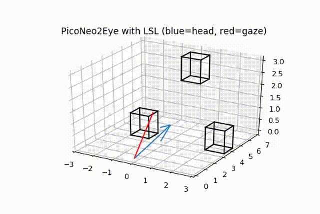

# PicoNeo2Eye for Lab Streaming Layer

Instructions and sample code for streaming gaze and head pose from [Pico Neo 2 Eye](https://www.pico-interactive.com/us/neo2.html) using [Lab Streaming Layer](github.com/sccn/labstreaminglayer).

The above plot is very low rate (3 Hz) reconstruction of LSL data recorded while I first looked around at 3 targets, then held my gaze still while moving my head. You can find a 60 Hz reconstruction mp4 in the test_data folder.

## Getting Started

The [Tobii VR Pico Neo 2 Eye Development Guide](https://vr.tobii.com/sdk/develop/unity/getting-started/pico-neo-2-eye/) provides a good high-level overview of the steps to build a Unity project for the Pico Neo 2 Eye. However, it is lacking in detail, so it's a good idea to follow its advice and refer heavily to the [Pico VR Android SDK documentation](http://static.appstore.picovr.com/docs/sdk/en/index.html).

For LSL, read the [LSL in Unity README](https://github.com/labstreaminglayer/liblsl-Csharp/blob/master/README-Unity.md). If you are satisfied using a potentially old version of liblsl in your project (Fall 2020) then you may copy the contents of this repository's `LSL2Plugins` folder into your project's `Assets/Plugins` folder.

## Streaming Head Pose

Copy PoseLSLOutlet.cs from this repo's Scripts folder to your project's Scripts folder. Attach it as a component to the `Pvr_UnitySDK > Head` object. When the application is run, head position data will be transmitted over a LSL stream with default name `Unity.VRHeadPose` and type `MoCap`. The channels are 'PosX', 'PosY', 'PosZ', 'RotW', 'RotX', 'RotY', 'RotZ', the last 4 forming a quaternion.

## Streaming Gaze

Copy GazeLSLOutlet.cs from this repo's Scripts folder to your project's Scripts folder. Attach it as a component to the `Pvr_UnitySDK > Head object`. When the application is run, gaze data will be transmitted over a LSL stream with default name `Unity.TobiiGaze` and type `Gaze`. The channels are 'Timestamp', 'ConvergenceDistance', 'ConvergenceDistanceIsValid', 'GazeRayOriginX', 'GazeRayOriginY', 'GazeRayOriginZ', 'GazeRayDirectionX', 'GazeRayDirectionY', 'GazeRayDirectionZ', 'GazeRayIsValid', 'IsLeftEyeBlinking', 'IsRightEyeBlinking'. See `TobiiXR.GetEyeTrackingData` in the [Tobii API docs](https://vr.tobii.com/sdk/develop/unity/documentation/api-reference/) for more info.

## Streaming Gaze Events

Copy EventLSLOutlet.cs and EventController.cs from this repo's Scripts folder to your project's Scripts folder. Attach both as components to the `Pvr_UnitySDK > Event` object. Also copy ExperimentObject.cs over and attach it to any objects that you wish to trigger an event when they are gazed upon. When the application is run, game objects will publish their state as JSON-encoded markers over a LSL stream with default name `Unity.GameEvents` and type `Markers`.

## Analyzing the Data

Most LSL users save their data to an XDF file using [LabRecorder](github.com/labstreaminglayer/App-LabRecorder). In this repository's `test_data` folder, you'll find an example xdf file, a jupyter notebook demonstrating how to import the file and visualize the data, an animated gif and a mp4 file.
